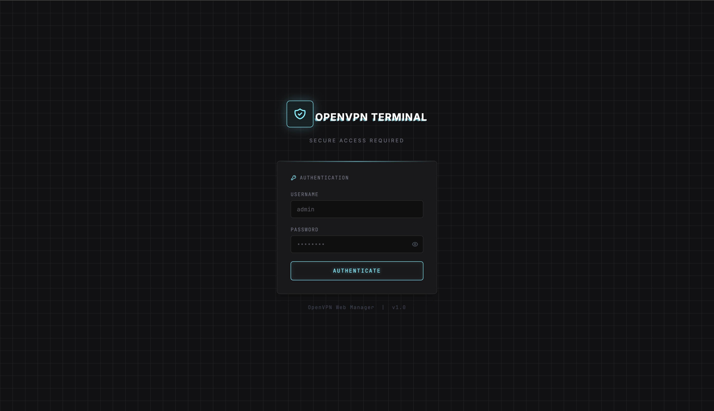
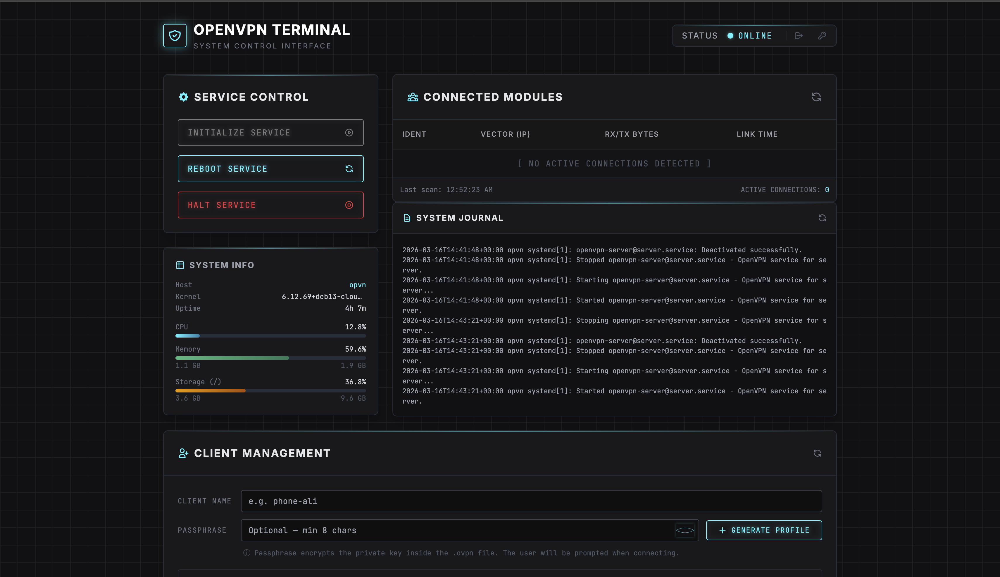
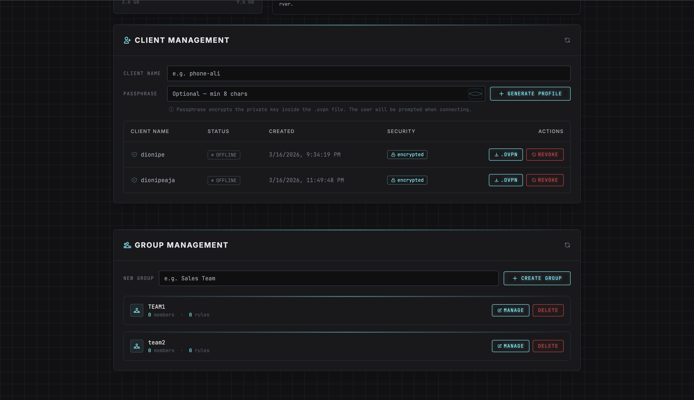

# OpenVPN Web Manager

Web UI berbasis Go untuk mengelola OpenVPN server — start/stop/restart service,
monitor koneksi aktif, generate & revoke client `.ovpn`, serta manajemen group + rules.

---

## Screenshots

| Login | Dashboard |
|---|---|
|  |  |



---

## Daftar Isi

1. [Prasyarat](#1-prasyarat)
2. [Instalasi OpenVPN & EasyRSA](#2-instalasi-openvpn--easyrsa)
3. [Inisialisasi PKI & Sertifikat Server](#3-inisialisasi-pki--sertifikat-server)
4. [Konfigurasi Server OpenVPN](#4-konfigurasi-server-openvpn)
5. [IP Forwarding & NAT](#5-ip-forwarding--nat)
6. [Instalasi Web Manager](#6-instalasi-web-manager)
7. [Konfigurasi Manager](#7-konfigurasi-manager)
8. [Systemd Service](#8-systemd-service)
9. [Deploy ke Server Lain (Multi-Server)](#9-deploy-ke-server-lain-multi-server)
10. [Referensi Konfigurasi](#10-referensi-konfigurasi)

---

## 1. Prasyarat

| Kebutuhan | Versi minimum |
|---|---|
| OS | Debian 11 / Ubuntu 22.04 atau lebih baru |
| Go | 1.21+ (hanya untuk build dari source) |
| OpenVPN | 2.6+ |
| EasyRSA | 3.x |
| Akses | `root` atau `sudo` |

---

## 2. Instalasi OpenVPN & EasyRSA

```bash
apt-get update
apt-get install -y openvpn easy-rsa
```

Salin EasyRSA ke direktori konfigurasi OpenVPN:

```bash
cp -r /usr/share/easy-rsa /etc/openvpn/easy-rsa
```

---

## 3. Inisialisasi PKI & Sertifikat Server

```bash
cd /etc/openvpn/easy-rsa

# Inisialisasi PKI (hapus PKI lama jika ada)
./easyrsa --batch init-pki

# Buat Certificate Authority
echo "openvpn-server" | ./easyrsa --batch build-ca nopass

# Buat request & tanda-tangani sertifikat server
./easyrsa --batch gen-req server nopass
./easyrsa --batch sign-req server server

# Generate Diffie-Hellman parameter (butuh beberapa menit)
./easyrsa gen-dh

# Generate TLS Auth key
openvpn --genkey secret pki/ta.key
```

Salin semua file ke direktori server:

```bash
mkdir -p /etc/openvpn/server
mkdir -p /etc/openvpn/clients
mkdir -p /var/log/openvpn

cp pki/ca.crt              /etc/openvpn/server/
cp pki/issued/server.crt   /etc/openvpn/server/
cp pki/private/server.key  /etc/openvpn/server/
cp pki/dh.pem              /etc/openvpn/server/
cp pki/ta.key              /etc/openvpn/server/

chmod 600 /etc/openvpn/server/server.key \
          /etc/openvpn/server/ta.key
```

---

## 4. Konfigurasi Server OpenVPN

Buat file `/etc/openvpn/server/server.conf`:

```conf
# ── Dasar ────────────────────────────────────────────────────
port 1194
proto udp
dev tun

# ── Sertifikat ───────────────────────────────────────────────
ca   /etc/openvpn/server/ca.crt
cert /etc/openvpn/server/server.crt
key  /etc/openvpn/server/server.key
dh   /etc/openvpn/server/dh.pem

# TLS Auth (0 = server side)
tls-auth /etc/openvpn/server/ta.key 0
key-direction 0

# ── Jaringan ─────────────────────────────────────────────────
# Subnet VPN 10.8.0.0/24 (sesuaikan jika bentrok)
server 10.8.0.0 255.255.255.0

ifconfig-pool-persist /var/log/openvpn/ipp.txt

# Arahkan semua traffic client melalui VPN
push "redirect-gateway def1 bypass-dhcp"

# DNS untuk client
push "dhcp-option DNS 8.8.8.8"
push "dhcp-option DNS 8.8.4.4"

# Izinkan komunikasi antar client
client-to-client

# ── Stabilitas ───────────────────────────────────────────────
keepalive 10 120
persist-key
persist-tun

# Turunkan privilege setelah start
user nobody
group nogroup

# ── Enkripsi ─────────────────────────────────────────────────
cipher AES-256-GCM
data-ciphers AES-256-GCM:AES-128-GCM:AES-256-CBC

# Kompresi dinonaktifkan (mitigasi VORACLE)
compress stub-v2
push "compress stub-v2"

# ── TLS Mode ─────────────────────────────────────────────────
tls-server
remote-cert-tls client

# ── Log ──────────────────────────────────────────────────────
status /var/log/openvpn/openvpn-status.log
log-append /var/log/openvpn/openvpn.log
verb 3
mute 20
```

Aktifkan dan jalankan service:

```bash
systemctl enable --now openvpn-server@server
systemctl status openvpn-server@server
```

---

## 5. IP Forwarding & NAT

```bash
# Aktifkan IP forwarding sekarang
sysctl -w net.ipv4.ip_forward=1

# Buat permanen (aktif setelah reboot)
sed -i 's/#\?net\.ipv4\.ip_forward\s*=.*/net.ipv4.ip_forward=1/' /etc/sysctl.conf
sysctl -p
```

Tambahkan aturan NAT iptables (ganti `eth0` dengan interface yang mengarah ke internet):

```bash
IFACE=$(ip route get 1.1.1.1 | awk '{print $5; exit}')

iptables -t nat -A POSTROUTING -s 10.8.0.0/24 -o "$IFACE" -j MASQUERADE
iptables -A FORWARD -i tun0 -o "$IFACE" -j ACCEPT
iptables -A FORWARD -i "$IFACE" -o tun0 -m state --state RELATED,ESTABLISHED -j ACCEPT

# Simpan iptables agar persistent
apt-get install -y iptables-persistent
netfilter-persistent save
```

---

## 6. Instalasi Web Manager

```bash
# Clone atau copy ke server
cp -r . /opt/openvpn-web-ui
cd /opt/openvpn-web-ui

# Build binary
go build -o openvpn-manager .
```

---

## 7. Konfigurasi Manager

### 7.1 File utama — `manager.toon`

Salin ke lokasi yang dibaca binary:

```bash
cp data/manager.toon /etc/openvpn/manager.toon
chmod 640 /etc/openvpn/manager.toon
```

Isi penting yang perlu disesuaikan:

```toml
admin_user: admin
admin_pass: <hash-bcrypt>           # lihat cara generate di bawah
ovpn_service: openvpn-server@server # nama unit systemd
public_ip: <IP-PUBLIK-SERVER>       # ditulis ke .ovpn client
listen_port: 8080                   # port web UI

paths:
  easy_rsa:    /etc/openvpn/easy-rsa
  clients:     /etc/openvpn/clients
  server_certs: /etc/openvpn/server
```

**Generate hash password:**

```bash
cd /opt/openvpn-web-ui
./openvpn-manager --hash-pass passwordbaru
# Salin output ke admin_pass di manager.toon
```

### 7.2 File per-server — `manager.env`

Digunakan untuk override tanpa mengubah `manager.toon`.
Berguna saat deploy ke banyak server.

```bash
cp data/manager.env /etc/openvpn/manager.env
chmod 640 /etc/openvpn/manager.env
```

Edit minimal:

```ini
OVPN_PUBLIC_IP=<IP-PUBLIK-SERVER>     # wajib diubah per server
OVPN_PORT=8080
OVPN_SERVICE=openvpn-server@server
```

Kosongkan `OVPN_PUBLIC_IP` untuk **auto-detect** via `api.ipify.org` saat startup.

### 7.3 Prioritas konfigurasi

```
Env var shell  >  manager.env  >  manager.toon  >  built-in default
```

---

## 8. Systemd Service

```bash
cp openvpn-manager.service /etc/systemd/system/
systemctl daemon-reload
systemctl enable --now openvpn-manager
systemctl status openvpn-manager
```

Cek log:

```bash
journalctl -u openvpn-manager -f
```

---

## 9. Deploy ke Server Lain (Multi-Server)

```bash
# Di server baru:
rsync -av /opt/openvpn-web-ui/   server-baru:/opt/openvpn-web-ui/
rsync -av /etc/openvpn/manager.toon \
          /etc/openvpn/manager.env  server-baru:/etc/openvpn/

# Di server baru — sesuaikan identitas server
nano /etc/openvpn/manager.env
# → ubah OVPN_PUBLIC_IP ke IP publik server tersebut
# → ubah OVPN_SERVICE jika nama unit systemd berbeda

systemctl restart openvpn-manager
```

---

## 10. Referensi Konfigurasi

### `manager.toon`

| Key | Default | Keterangan |
|---|---|---|
| `admin_user` | `admin` | Username login |
| `admin_pass` | `changeme` | Plain-text atau bcrypt hash |
| `ovpn_service` | `openvpn-server@server` | Nama unit systemd OpenVPN |
| `public_ip` | *(auto-detect)* | IP publik untuk `.ovpn` client |
| `listen_port` | `8080` | Port web UI |
| `session_ttl` | `24h` | Durasi sesi login |
| `paths.easy_rsa` | `/etc/openvpn/easy-rsa` | Direktori EasyRSA |
| `paths.clients` | `/etc/openvpn/clients` | Direktori simpan `.ovpn` |
| `paths.server_certs` | `/etc/openvpn/server` | Direktori sertifikat server |

### Environment Variables

| Variabel | Keterangan |
|---|---|
| `OVPN_USER` | Override `admin_user` |
| `OVPN_PASS` | Override `admin_pass` (plain-text) |
| `OVPN_SERVICE` | Override nama unit systemd |
| `OVPN_PUBLIC_IP` | Override IP publik server |
| `OVPN_PORT` | Override port web UI |

### Struktur Direktori

```
/opt/openvpn-web-ui/
├── main.go                     # Source code utama
├── go.mod
├── openvpn-manager             # Binary hasil build
├── openvpn-manager.service     # Systemd unit (template)
├── data/
│   ├── manager.toon            # Template config utama
│   └── manager.env             # Template per-server env
└── public/
    ├── index.html              # Dashboard
    └── login.html              # Halaman login

/etc/openvpn/
├── manager.toon                # Config aktif
├── manager.env                 # Env override per-server
├── manager-groups.json         # Data group (auto-generated)
├── easy-rsa/                   # PKI & EasyRSA
│   └── pki/
├── server/                     # Sertifikat server
│   ├── ca.crt
│   ├── server.crt / server.key
│   ├── dh.pem
│   ├── ta.key
│   └── server.conf
└── clients/                    # File .ovpn client (auto-generated)
```

